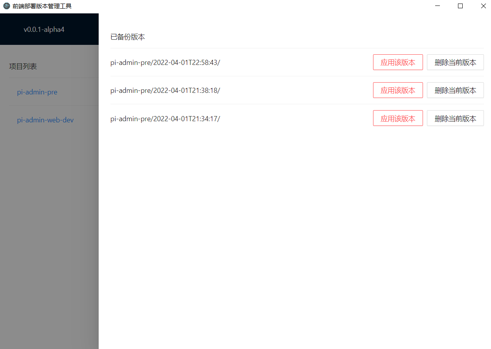
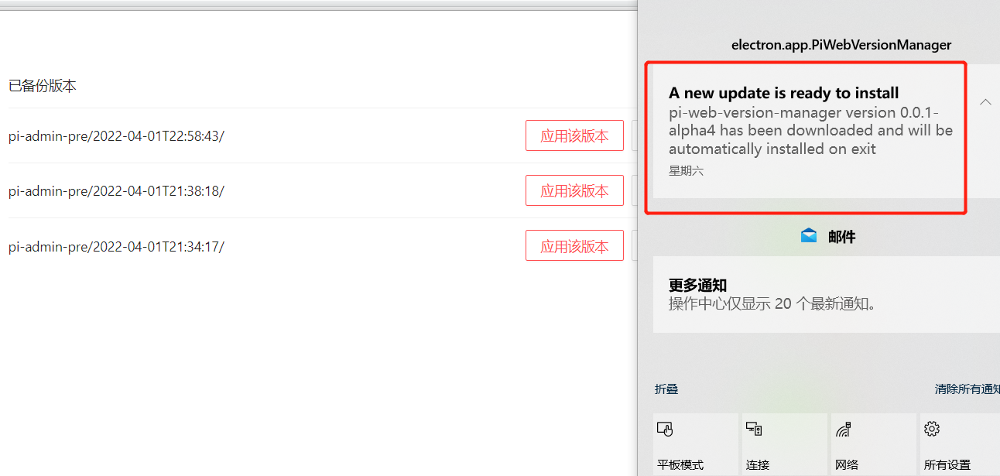
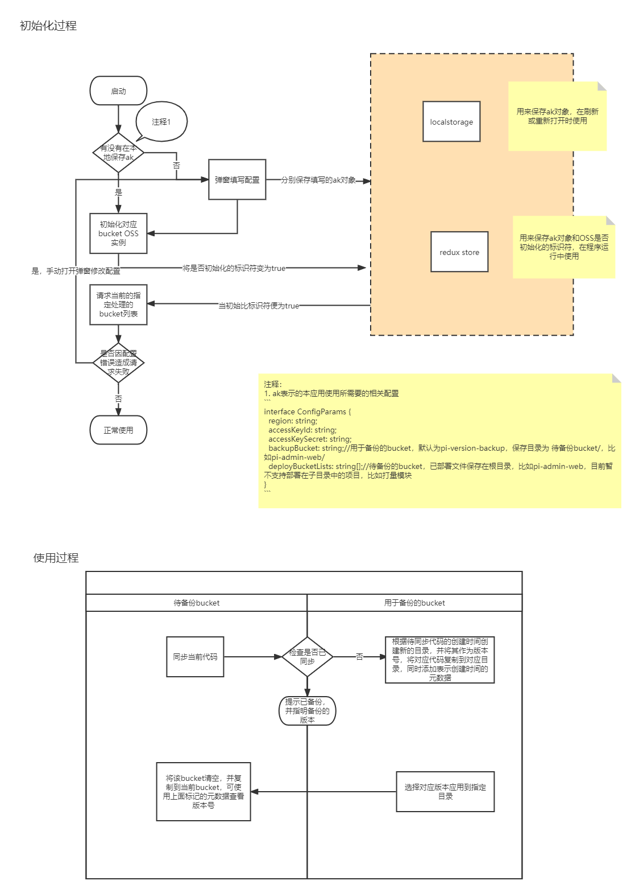

#需求场景

当前前端发布时使用的静态服务器是阿里云 oss，其本身没有版本回退的功能，而当前使用的自动化部署使用的是 jenkins，每次发布需要五分钟左右（主要是拉依赖）。

这就造成一些问题，比如

1. 发版出现问题时，版本回退需要重新执行发布流程，时间比较长（大约需要五分钟，主要是拉依赖）

2. 发布不稳定（比如网络问题或者依赖版本问题）

#需求描述

由于以上问题，当版本迭代上线需要回滚时不能快速完成，会引发各种线上事故，因此需要优化这一过程。

#解决思路

我们当前的回退方式，无论是时间长还是不稳定都是 build 这个过程造成的，我们为了解决这个问题可以通过版本备份各个线上版本，然后需要回滚时，将对应版本的静态文件复制到线上所需的 bucket 即可。

要完成这个过程，oss 提供了 oss 浏览器，可以手动完成以下过程，

1. 发布稳定后，将该版本复制到某个文件夹，并设置版本号

2. 如果回滚时需要该版本就把该备份复制到原来 bucket

虽然耗时减短了，但是手动操作步骤过多，准确性难以保证，我们现在要通过另外的工具简化这个过程，即这里要介绍的部署版本管理工具。

#工具介绍

该工具是使用 electron 和 OSS sdk 开发的跨平台应用，以[electron-react-boilerplate](https://github.com/electron-react-boilerplate/electron-react-boilerplate)为基础。  
目前已发布[alpha 版本](https://github.com/dino-zhao/deploy-version-manager/releases)

已完成功能包括

1. 版本备份

2. 版本恢复

3. 应用自动更新（启动时检查更新并自动下载，当关闭时更新新版，目前只支持 windows 版）

应用初始化和使用过程如下

